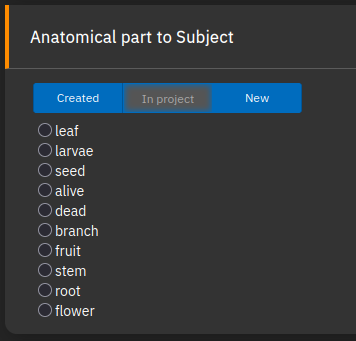
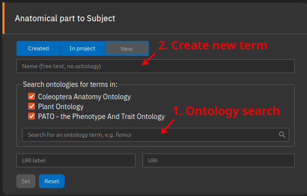
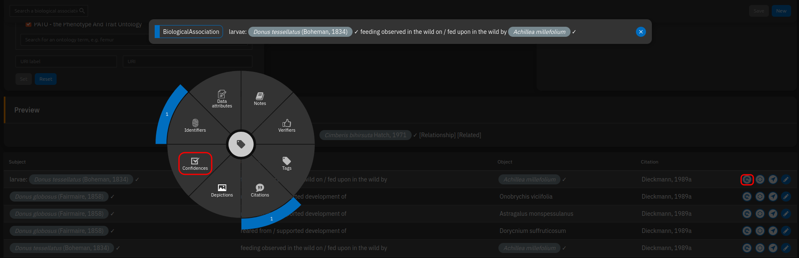
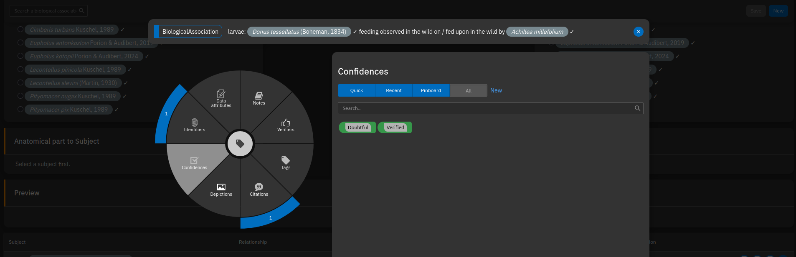

# Biological Relationships

## Preface - Biological Relationship vs Biological Association

In TaxonWorks, **Biological Relationships are definitions of biological interaction** that can take place between two objects (feeds on, reared from, collected from...).

**Biological associations** utilize two objects together with the Biological Relationship and add additional information if provided (a source, distribution, anatomical parts...). Those two objects can be:
1. Otu's (= species name of the beetle or plant)
2. FieldOccurence (for example a simple observation)
3. CollectionObjects (usually a specimen from a historical collection in a museum)
4. AnatomicalParts (usually the infested body part of the plant).

A simple **Biological association** could be `Adosomus roridus` (= Otu) was `reared from` (= relationship) the `stem of Achillea millefolium` (= AnatomicalPart of an Otu). Those statements can be further annotated e.g. with an asserted distribution (in France), images (of the eating trace) and many more.

The overall goal of this task is to simplify biological associations that have been observed either directly in nature or reported in scientific publications (i.e., sources). These statements often vary in accuracy and may include different types of additional information. Through this task, we aim to provide a structured environment for storing such data in a database and enabling its use in various applications, such as phylogenetic analyses and field guides.

**Problems/Limitations:** More work is needed to adequately include the biology of exceptional groups such as Scolytinae, Platypodinae, and Cossoninae, as well as processes like pollination and interactions with fungi or other animals, and the biology of saproxylic species.
In saproxylic species, a key challenge is that the identity of the “host” is often unclear. The biology of these weevils cannot easily be described as a simple relationship between two species; rather, it represents an interaction between a weevil and a specific microhabitat.

---

<!-- #### Example

Masur & Wartmann (2025) reported from Baden-Württemberg that they observed larvae of *Adosomus roridus* feeding in the roots of *Achillea millefolium*.

This can be modeled as a biological association between *Adosomus roridus* and *Achillea millefolium*, where:

- *Adosomus roridus* participates in the interaction as the AnatomicalPart [larva], with the BiologicalRelationship [consumer in a trophic relationship].
- *Achillea millefolium* participates in the interaction as AnatomicalPart [root]
- The interaction between both was observed in a locality (can be modeled as AssertedDistrution Baden-Württemberg, alternatively using CollectionObject or FieldOccurrence with a  or a more precise place)
- The whole of the data has a citation: Masur & Wartmann (2005)

All of these aspects can be represented in TaxonWorks. The properties may appear redundant in some cases, but they are important as they assure semantic meaning and allow to filter the dataset. Another relationship can be defined for adult feeding of the weevils on their host plant, which was also reported in the same paper.

In TaxonWorks, the relationship (= e.g. larva feeding in roots of) cannot be composed dynamically by mixing a custom range of properties for each particular instance (= e.g. larva of *Adosomus* on *Achillea*) of the relationship. Instead, a **relationship** is defined once for reuse across many interaction instances, with fixed participant role properties.

<table class="bio-rel">
<thead>
<tr>
  <th colspan="3" class="subject">Partner 1</th>
  <th colspan="3" class="object">Partner 2</th>
</tr>
<tr>
  <th class="subject">Taxon</th>
  <th class="subject">Interaction properties</th>
  <th class="subject">Interaction name</th>
  <th class="object">Interaction inverted name</th>
  <th class="object">Interaction properties</th>
  <th class="object">Taxon</th>
</tr>
</thead>
<tbody>
<tr>
  <td><em>Adosomus roridus</em></td>
  <td>[larva], [endophagous feeding], [consumer in trophic relationship]</td>
  <td>endophagous larva feeds in roots of</td>
  <td>roots are fed upon by endophagous larva of</td>
  <td>[root], [resource in trophic relationship]</td>
  <td><em>Achillea millefolium</em></td>
</tr>
<tr>
  <td colspan="6" class="note"><strong>Asserted distribution:</strong> Baden-Württemberg (if the relationship is used for specimens instead of species, the locality can be exact coordinates)</td>
</tr>
<tr>
  <td colspan="6" class="note"><strong>Citation:</strong> Masur &amp; Wartmann 2025</td>
</tr>
</tbody>
</table>


---
-->
## Theory

Our knowledge of weevil biology is limited and will always remain so. Therefore, any attempt to catalogue weevil–host plant interactions should focus on capturing information from published statements or direct observations. Rather than trying to represent biological reality itself, we should record *what was actually observed* (e.g., "a specimen was reared from a seed pod of plant X at location Y, according to source Z") instead of making generalized claims such as "the species develops in seed pods of plant X". Similarly, an experienced entomologist may have stated that a beetle "lives on" a plant, when in fact only adult feeding on that plant was observed. Statements like "lives on" inherently include assumptions about a species behaviour that may not have been directly observed and can lead to biased interpretations.
For this reason, such statements need to be carefully evaluated and assigned to the most accurate observable category, such as "collected from" or "observed feeding in the wild on". We have given considerable thought to what can actually be observed and have developed a set of terms that we believe covers most situations.

## Scope: What kind of information do we want to store?


When converting data into a structured format, some information is inevitably lost. However, the database also serves as an index to the literature and other sources of evidence. Not all details are captured within TaxonWorks, but the original source can always be consulted for a more comprehensive—albeit human-readable—description (e.g., a detailed description of a feeding trace).

When entering data, you should consider the following questions:
<!--
- We need to be able to extract the most relevant inormatiofn from the dataset.
    - Asserted statements from literature (sometimes not directly backed by evidence). Asserted statements from literature can have a lot of detail, or they just link the taxon names of the two species.
    - Direct observation (either from literature or from field occurrence/collection object)
        - Observation data: needs different lines of evidence. Was the beetle sitting on the plant or was it feeding?
- Images of interactions: feeding marks or galls can be distinctive. We would like to have a collection of images that illustrate the relationship
**What's most important information we want to store?:**
-->

- Was the plant merely visited, or was feeding observed? If so, was it adult or larval feeding? Was the observation made in the wild, or was the specimen collected together with plant material and examined later for feeding traces?
- Was the species reared? This implies that larvae were collected along with their host plant and the full life cycle was observed until the adult beetle emerged. Rearing records provide the strongest evidence for host–plant relationships, as they constitute direct evidence.
- Which plant part is used by the larvae or adult beetles for feeding?
- Was the specimen endophagous or exophagous?
- Is the interaction characterized by specific structures such as galls or leaf rolls?
- On which plant part were the adults observed sitting (optional)?
- Does the source provide general information about feeding specificity, such as mono-, oligo-, or polyphagy (optional)?

Interactions between larvae and plants are generally more relevant than those involving adults. They are more likely to have evolutionary significance, and the availability of suitable larval host plants is essential for reproduction, with important implications for conservation, crop protection, and species distribution.

Nevertheless, observations of adult beetles remain valuable: they can indicate where species are likely to be found and may provide indirect evidence of host–plant relationships that have not yet been formally studied. For example, repeatedly collecting adults from the same plant species can suggest a consistent feeding association.

<!--

### Data structure
The properties could be interlinked as part of an ontology. This would make some properties redundant for some relationships (e.g. [resource for larval feeding] is a subset of [resource in a trophic relationship]). But it's better to store all properties to make the dataset more self-contained.
If you deal with a relationship not integrated please don't hesitate to contact us to discuss a solution for your problem.
---

## List of Properties

**Insect life stages:**

- **imago** (insect life stage: adult)
- **larva** (insect life stage: larva)

**Plant anatomical parts:**

- **roots** (plant anatomical part: referring to the root system in general)
- **root collar** (plant anatomical part: transitional zone between roots and stem)
- **storage organ** (general term for bulbs, tubers, rhizomes etc.)
- **stem** (plant anatomical part: stem)
- **leaf** (plant anatomical part: leaf)
- **bud, unspecified** (plant anatomical part: bud, unspecified)
- **bud, vegetative** (plant anatomical part: bud of vegetative growth, not a flower bud)
- **bud, flower** (plant anatomical part: flower bud)
- **flower** (plant anatomical part: flower of a plant/inflorescence)
- **fruit** (plant anatomical part: fruit)
- **Plant, part unspecified** (plant anatomical part: unspecified)

**Feeding modes:**

- **exophagous** (feeding while dwelling outside of the trophic resource)
- **endophagous** (feeding while dwelling inside of the trophic resource)

**Ecology:**

- **consumer in trophic relationship** (e.g. a weevil that is feeding on something)
- **resource in a trophic relationship** (e.g. a plant that is consumed by a weevil)
- **consumer in saprophagous trophic relationship**
- **resource in saprophagous trophic relationship**
- **resource for larval feeding** (has special importance because larvae are often more specialized than adults)
- **galler** (consumer in a trophic relationship involving a gall, always to be used together with [consumer in a trophic relationship]. This is referring to the organism found in the gall, not necessarily the one that has formed the gall)
- **gall host** (resource in a trophic relationship involving a gall, always to be used together with [resource in trophic relationship]. This is referring to the organism that is bearing a gall.)
- **leaf roller** (consumer in a trophic relationship involving a leaf roll, always to be used together with [consumer in a trophic relationship]. This is referring to the organism found in the leaf roll, not necessarily the one that has formed the leaf roll)
- **leaf roller host** (resource in a trophic relationship involving a leaf roll, always to be used together with [resource in trophic relationship] and [leaf]. This is referring to the organism that is bearing a leaf roll.)
- **inquiline** (not necessarily consumer in a trophic relationship)
- **inquiline host** (not necessarily resource in a trophic relationship)

**Economy:**

- **agricultural pest** (insect that has been reported to be an agricultural pest)

---
-->

## List of Biological Relationships

```bio-rel
collected from | Yielded from
Used for any life stage of an organism that was simply collected from a plant (e.g., “on milkweed”). It is also applied to collection specimens whose locality labels include a plant name.
```

```bio-rel
feeding observed in the wild on | fed upon in the wild by
Used when feeding by any life stage of an organism has been observed in the wild. This term should also be used if the specimen was subsequently collected, as “feeding in the wild” represents the more informative observation.
```

```bio-rel
feeding observed in experimental setup on | fed upon in experimental setup by
Used when a specimen has been observed feeding on a plant in an experimental setting (e.g., larvae and plant material collected and observed in a petri dish to study feeding behavior).
```

```bio-rel
reared from | yielded by rearing
Used when the complete life cycle of a weevil has been observed, either in the wild or in an experimental setting.
```

```bio-rel
undefined relationship with | undefined relationship with
None (no information given)
```

<!---
### Second set, focus on biology

```bio-rel
inquiline of | host for inquiline
Inquilinism without defining life stages or plant organs. Can also be used to describe a relationship between weevils and ants, or between <em>Hormops</em> and squirrels. See also "larva is inquiline of", which is more suitable for inquilines in galls.
```

### Third set, focus on larval biology

```bio-rel
larva feeds on | larval host for
This is a relationship that can be used for unspecified larval relationships. The relationship should only be used if evidence for larval feeding is presented by the source! Otherwise, use something like "asserted relationship".
```

```bio-rel
larva is inquiline of | host for inquiline larva
This will often try to represent tripartite relationships, usually between two insects and a plant. TaxonWorks does not support that directly. I suggest making two entries, one between the inquiline and its insect host (using this relationship), and one with the plant (using another relationship, such as one of the larval galler relationships).
```

```bio-rel
larva in leaf roll on | has leaf roll with larvae of
This relationship is used for the leaf rolls of Attelabidae.
```

---

## Decision Chart

[View decision chart (Google Drive)](https://drive.google.com/file/d/1wH2D9EwOsoI-XfKKipNpkV4TOxbqBsV-/view?usp=sharing)

An attempt to sort relationships according to "asserted", "asserted or observational" and "observational":
[View sorting chart (Google Drive)](https://drive.google.com/file/d/1zf3lQmlWib-aO218YkNnpL579aAiPRW8/view?usp=sharing)

---
--->

## How to add information about life stages/ the infested body parts?

If you've observed a larvae eating on the leaf of any plant you are dealing with "anatomicalParts" in Taxonworks. Depending on if you we're talking about the beetle or the plant there are two classes:

1. lifeStage: can be larvae, egg or puppae of a beetle. Adult is considered to be default und has not be selected
2. real anatomical parts: body parts of the plant life leaf, flower bud, roots...

Even though it's clear for us, that a herb has a leaf, steam, flower bud and roots this it's not configured in Taxonworks by default. Thus everytime we want to use AnatomicalParts of a plant or beetle in a biological association, we have to create it first seperately. To do that in an easy way, you can create our reuse/ select existing anatomicalParts simultaneously with the complete biological association. To stabilize our dictionary and to avoid duplicates produced by misspelling you can use in most cases the "In project" tab. Here you find all terms which have been used within this project by now.

When you observe a larva feeding on a plant leaf, you are dealing with AnatomicalParts in TaxonWorks. Depending on whether you are referring to the beetle or the plant, there are two classes:

1. LifeStage – refers to the stage of the beetle: larva, egg, or pupa. The adult is considered the default and does not need to be selected.
2. Real anatomical parts – refers to parts of the plant, such as leaf, flower bud, or roots.

Although it is obvious that a plant has leaves, stems, flower buds, and roots, these are not preconfigured in TaxonWorks by default. Therefore, whenever you want to use AnatomicalParts for a plant or beetle in a biological association, you must create them first. To make this easier, you can create new terms or reuse/select existing anatomical parts simultaneously while entering the biological association. To stabilize our dictionary and avoid duplicates caused by misspellings, you can use the “In project” tab. This tab shows all terms that have already been used within the project.

<p align="center">
  
</p>

If you want to use a new term, you can 1. Search for terms provided by the selected ontologies or 2. create a new term if an appropriate one cannot be found:

<p align="center">
  
</p>

## Sources

If the information was digitized from scientific literature, the paper or book can be cited via the “Source” panel. You are encouraged to include the exact page number, especially if the publication contains multiple pieces of information.

For personal observations without a publication, leave this field blank. Your name will automatically appear on the TaxonPages as the source.

## Shapes

Many host–plant relationships vary across broad geographic ranges. Therefore, it can be useful to record the location of an observation. Since the search function is not a global tool that includes all possible geographic features—such as mountains, lakes, or cities—it is often necessary to add the desired feature manually if it is not yet available. In many cases, selecting the country can serve as a first step to capture coarse geographic patterns, even if a more precise location is provided in the publication.

## Doubt about a biological Association?

In case you have doubt about a biological association you're digitizing, you can use "Confidences" to keep track of this (below the task in the table via radial annotator):
<p align="center">
  
</p>

<p align="center">
  
</p>


## Tags

Similar to marking doubts, it is possible to tag specific biological information to a biological association using the radial annotator in the table below the task.

- Endophagous: larvae feed inside tissues
- Exophagous: larvae feed outside tissues
- Monophagous: according to the cited literature, this species feeds exclusively on a single plant species
- Oligophagous: according to the cited literature, this species feeds on a few closely related plant species
- Polyphagous: according to the cited literature, this species feeds on many plant species

Classifiers such as mono-, oligo-, and polyphagy cannot be automatically derived from filters when host–plant associations are strictly stored in a database, as is the case in TaxonWorks. Since this information can be very useful - for filtering data or predicting where a beetle might be found — it needs to be explicitly implemented.

## Practical limitations

Currently, our TaxonWorks instance is focused on beetles, not plants. As a result, plant species names are mostly stored as OTUs without an assigned taxon name and therefore without plant taxonomy. Many plant names have already been integrated, but many are still missing.

If a plant name is missing, you can create it while entering the biological association. To do this, simply enter random letters or numbers until the “Create new OTU” function is triggered, then enter the species name in the format “Genus species”. These names will later be matched with large taxonomy databases (e.g., Catalogue of Life) to incorporate plant taxonomy into our TaxonWorks instance.

<video controls autoplay loop muted>
  <source src="../assets/videos/Create_Otu.webm" type="video/webm">
  Your browser does not support the video tag.
</video>


## Preview: TaxonPages

An example can be seen on TaxonPages:

- [*Adosomus roridus* (weevil, with list of plants)](https://catalog.curculionoidea.org/#/otus/732686/overview)
- [*Achillea millefolium* (plant, with list of weevils)](https://catalog.curculionoidea.org/#/otus/735489/overview)

TaxonPages, which is a static page that displays data via the TaxonWorks API, currently has some limitations in how it presents biological relationships:

- Asserted distribution of a biological relationship is not provided (ideas: as text within the table, or on the map for the species distribution in a separate color)
- Citation for the relationship is given as short reference only, without the option to open it to see the full record with clickable links/DOI
- Under certain circumstances, plants can inherit the distribution of their insect associates
